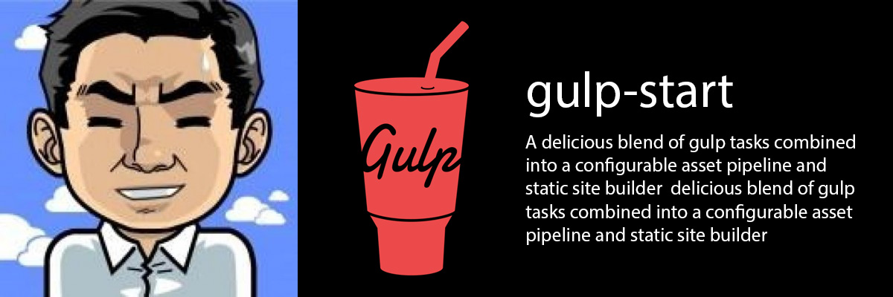

# gulp-start

--

# 

A delicious blend of gulp tasks combined into a configurable asset pipeline and static site builder 

Gulp Starter is a delicious blend of tasks and build tools poured into [Gulp](http://gulpjs.com/) to form a full-featured modern asset pipeline. It can be used as-is as a static site builder, or can be configured and integrated into your own development environment and site or app structure.

```bash
git clone https://github.com/aglovlyuk/gulp-start MyApp
cd MyApp
npm install
```

#### Run development tasks:
```
gulp
```
Aliases: `gulp default`

This is where the magic happens. The perfect front-end workflow. This runs the default gulp task, which starts compiling, watching, and live updating all our files as we change them. BrowserSync will start a server on port 9000, or do whatever you've configured it to do. You'll be able to see live changes in all connected browsers. Don't forget about the additional BrowserSync tools available on port 3001!
